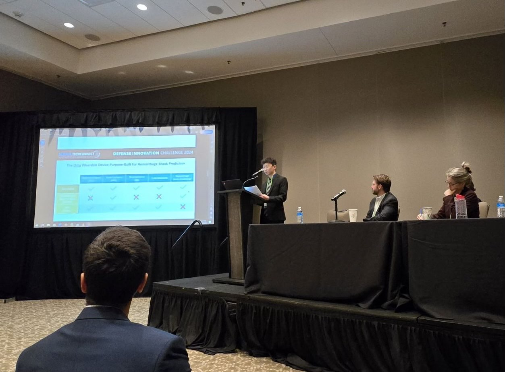

[[Pitch Deck Here](http://jermyeworm.github.io/files/DTC_2024_Pitch_Slide_Deck.pdf)] TechConnect Spotlight Pitch Awardee. Gave a 5 minute pitch towards a review panel with 2 minutes feedback at the 2024 National SBIR Innovation Summit in Austin, TX as part of the Defense TechConnect Innovation Spotlight on a wearable in-field hemorrhagic shock prediction device. 
